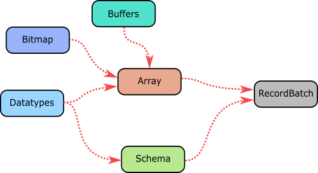

# Arrays

The Array is the center piece of the Rust Apache Arrow implementation. An array
is defined by different pieces of data and metadata, as it can be seen in the
next image.

From the image it can be seen that an Array is composed of one or more buffers,
a validity bitmap and a datatype definition. By using an Arrow Array, you can
map complex or nested data structures into memory, and with the data ordered
and loaded you can shared it across several processes using a RecordBatch. 

In Rust, the Array trait is the building block for all the available types of 
data containers. These include:

- BinaryArray
- DictionaryArray
- FixedSizeBinaryArray
- FixedSizeListArray
- LargeBinaryArray
- LargeListArray
- LargeStringArray
- ListArray
- PrimitiveArray
- StringArray
- StructArray
- NullArray
- UnionArray

Each of these containers follow a set of rules in order to define some sort of
behaviour. For example, a PrimitiveArray is made out of elements of the same
datatype and it contains one data buffer and one validity buffer. Or a
StructArray is a nested Array containing child fields that represent separate
PrimitiveArrays. By using a combination of these arrays the user
is capable of storing a variety of data in memory. 

> **Tip**. To have a better idea of the components that make each of the
> mentioned arrays and how they work together have a look at this
> [section](https://github.com/apache/arrow/blob/master/docs/source/format/Columnar.rst#physical-memory-layout)
> of the columnar format. 

Given the different components that define an array, it is important to
understand the basic unit that allocates the required memory used to hold data;
the buffer.
