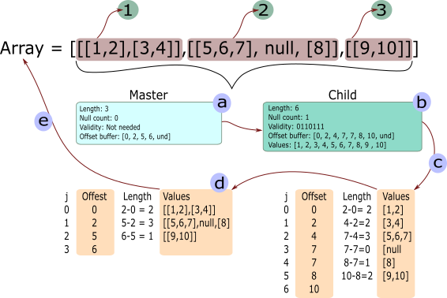

# Nested arrays

A primitive array is a useful struct to store values that have the same
datatype. However, if we only use primitive arrays it will be impossible to
represent complex data structures like datasets.  For this reason nested arrays
were introduced to the Apache Arrow specification, and in the Rust
implementation we have variable size lists, fixed size lists and structs.

## Variable size lists

A variable size list is used to represent arrays that are made of variable size
lists. In Rust we have the next containers to create variable size lists:

- ListArray
- StringArray
- BinaryArray
- LargeListArray
- LargeStringArray
- LargeBinaryArray

> **Note**. The difference between the Large and Normal arrays is the type of
> datatype offset used to align the space between elemets. In the normal
> arrays the offset is represented using  a i32 and in the large list a i64 is
> used.

> **Tip**. For more details on how a variable size list is defined and created, it is
> recommended that you read this
> [section](https://github.com/apache/arrow/blob/master/docs/source/format/Columnar.rst#variable-size-list-layout)
> of the Arrow columnar format. 


### ListArray

Lets continue this section by creating a
[ListArray](https://docs.rs/arrow/2.0.0/arrow/array/type.ListArray.html) to
show you how to create a variable size list and how it is represented in
memory.  For reference, we will use the next image to explain how a ListArray
is created and what is happening behind the scene.



In this example we are going to create a list that is made of three elements.
Each of these elements will me composed of one or more lists. For example,
element **1** will have 2 lists; element **2** will have 2 lists and 1 null;
and element **3** will have one list.


In general we can say that a nested array is made of a master data array and a
series of child data arrays. In the previous image the master array (**a**)
defines the general structure of the array, which in this case it has 3
elements, no nulls and has an offset buffer. The [offset
buffer](https://github.com/apache/arrow/blob/master/docs/source/format/Columnar.rst#variable-size-binary-layout)
is used to calculate how many numbers or elements each of the inner lists have. 

After the master data array comes the child array (**b**). The child array is
used to define the next nested level in the lists. In this case, the child
array has 6 elements, one null, and offset buffer and a values buffer. By using
this data representation one can nest as many lists as required. You only need
to define a next child and attach it to the ListArray. 

With this description in mind, lets create the list array from the image with
the next code:

```rust
use arrow::buffer::Buffer;
use arrow::array::{ArrayData, ListArray};
use arrow::datatypes::{DataType, Field, ToByteSlice};

fn main() {
    // First we create an ArrayData struct that will hold the values
    // from the array. These values are stored in one buffer aligned and padded.
    let value_data = ArrayData::builder(DataType::Int32)
        .len(10)
        .add_buffer(Buffer::from(&[1, 2, 3, 4, 5, 6, 7, 8, 9, 10].to_byte_slice()))
        .build();

    // Second we define the offsets what will define the lists from the
    // child data(b)
    let value_offsets = Buffer::from(&[0, 2, 4, 7, 7, 8, 10].to_byte_slice());

    // With the values and offset we can define the child data(b). The child
    // data represents the second level in the array. Notice the type for
    // the data array. It is made using the enum DataType::List indicating
    // that its a composite array
    let list_data_type = DataType::List(Box::new(Field::new("item", DataType::Int32, false)));
    let list_data = ArrayData::builder(list_data_type)
        .len(6)
        .add_buffer(value_offsets)
        .add_child_data(value_data)
        .null_bit_buffer(Buffer::from([0b00110111]))
        .build();
    
    // The last element is the master data array. This master data
    // array holds all the information required to define the ListArray
    let value_offsets = Buffer::from(&[0, 2, 5, 6].to_byte_slice());
    let list_data_type = DataType::List(Box::new(Field::new("item", DataType::Int32, false)));
    let list_data = ArrayData::builder(list_data_type)
        .len(3)
        .add_buffer(value_offsets)
        .add_child_data(list_data)
        .build();

    // If you print the list_data you will only see the combination of 
    // buffers that compose the data array
    println!("{:?}", list_data);

    // We need to define a ListArray to be able to understand the composed
    // data that is inside the ListArray
    let list_array = ListArray::from(list_data);
    println!("{:?}", list_array);
}
```

If you print the previous code you should see something like this (the output
was formated for this book):

```json
ListArray [
    ListArray [
        PrimitiveArray<Int32> [ 1, 2, ],
        PrimitiveArray<Int32> [ 3, 4, ],
    ],
    ListArray [
        PrimitiveArray<Int32> [ 5, 6, 7, ],
        null,
        PrimitiveArray<Int32> [ 8, ],
    ],
    ListArray [
        PrimitiveArray<Int32> [ 9, 10, ],
    ],
]
```

As you can see, the resulting array is identical to the one described in the
previous image. Notice that by printing the ListArray we are able to see the
real representation of the struct and not the buffers (values represented using
u8).  Behind the scenes the ListArray is doing the steps **(c)** and **(d)**
from the image, which create the nested lists and show that data in the correct
format and structure. 

A ListArray is very flexible and by following this procedure is possible to
create any type of nested lists.

### StringArray

A [StringArray](https://docs.rs/arrow/2.0.0/arrow/array/type.StringArray.html)
follows the same idea as a ListArray, the only difference is that the values
buffer is made of **u8**s that represents the letters or characters.

As an example lets create an StringArray that holds the next list:

```json
array = ["Hello", "from", null, "Apache", "Arrow"]
```

```rust
use arrow::buffer::Buffer;
use arrow::array::{ArrayData, StringArray};
use arrow::datatypes::{DataType, ToByteSlice};

fn main() {
    // First we define the values that will represent the letters 
    // from the array
    let values: [u8; 20] = [
        b'h', b'e', b'l', b'l', b'o', b'f', b'r', b'o', b'm', 
        b'A', b'p', b'a', b'c', b'h', b'e', b'A', b'r', b'r', b'o', b'w', 
    ];

    // And the offset that represents how many characters are in each word
    let offsets: [i32; 6] = [0, 5, 9, 9, 15, 20];

    // By the way, notice the order each buffer is added to the ArrayData.
    // Each buffer is stored in a vector of buffers, so the only reference 
    // other constructors will have is the vector index.
    let array_data = ArrayData::builder(DataType::Utf8)
        .len(5)
        .add_buffer(Buffer::from(offsets.to_byte_slice()))
        .add_buffer(Buffer::from(&values[..]))
        .null_bit_buffer(Buffer::from([0b00011011]))
        .build();
    let binary_array = StringArray::from(array_data);

    println!("{:?}", binary_array);
}
```

Your output should look similar to this:

```json
StringArray
    [ "hello", "from", null, "Apache", "Arrow", ]
```

As you can see, we can store as many words as we want by using a values buffer
and an offset buffer.

> **Tip**. From your code remove the null_bit_buffer method from the
> constructor and see how the empty space is now represented.

## Struct Array

[StructArrays](https://docs.rs/arrow/2.0.0/arrow/array/struct.StructArray.html)
are used to represent mixed data, each being identified by a name and a
datatype.  As an example we have this array:

```json
array = {
    "a": [false, null, null, null, true],
    "b": [null, 28, 42, null, null],
    "c": [1, 2, 3, 4, 5]
}
```

As it can be seen, each element in the array is represented by a tuple made of
a name and an array of values. To construct an struct you will need to define
the data that represents each of the fields. In the next node we will construct
the previous array using the ArrayData builders we have been using.

```rust
use arrow::buffer::Buffer;
use arrow::array::{ArrayData, StructArray};
use arrow::datatypes::{DataType, Field, ToByteSlice};

fn main() {
    // First we create all the base data that represents each of the elements
    // in the struct
    let boolean_data = ArrayData::builder(DataType::Boolean)
        .len(5)
        .add_buffer(Buffer::from([0b00010000]))
        .null_bit_buffer(Buffer::from([0b00010001]))
        .build();

    let int_data_b = ArrayData::builder(DataType::Int32)
        .len(5)
        .add_buffer(Buffer::from([0, 28, 42, 0, 0].to_byte_slice()))
        .null_bit_buffer(Buffer::from([0b00000110]))
        .build();

    let int_data_c = ArrayData::builder(DataType::Int32)
        .len(5)
        .add_buffer(Buffer::from([1, 2, 3, 4, 5].to_byte_slice()))
        .null_bit_buffer(Buffer::from([0b00011111]))
        .build();

    // The field types are used to indicate the type of data that each element
    // in the structarray has
    let mut field_types = vec![];
    field_types.push(Field::new("a", DataType::Boolean, false));
    field_types.push(Field::new("b", DataType::Int32, false));
    field_types.push(Field::new("c", DataType::Int32, false));

    let struct_array_data = ArrayData::builder(DataType::Struct(field_types))
        .len(5)
        .add_child_data(boolean_data.clone())
        .add_child_data(int_data_b.clone())
        .add_child_data(int_data_c.clone())
        .build();

    let struct_array = StructArray::from(struct_array_data);

    println!("{:?}", struct_array);
}
```

The output from the code should look like this:

```json
StructArray [
    -- child 0: "a" (Boolean)
    PrimitiveArray<Boolean> [ false, null, null, null, true, ]
    -- child 1: "b" (Int32)
    PrimitiveArray<Int32> [ null, 28, 42, null, null, ]
    -- child 2: "c" (Int32)
    PrimitiveArray<Int32> [ 1, 2, 3, 4, 5, ]
]
```

StructArrays can also be constructed using the StructArray::from helper, which
takes the underlying arrays and field types. In the next example we will
construct this struct using the From trait.

```json
array = {
    "b": [false, false, true, true],
    "c": [42, 28, 19, 31]
}
```

```rust
use arrow::array::{Array, BooleanArray, Int32Array, StructArray};
use arrow::datatypes::{DataType, Field};

use std::sync::Arc;

fn main() {
    let struct_array = StructArray::from(vec![
        (
            Field::new("b", DataType::Boolean, false),
            Arc::new(BooleanArray::from(vec![false, false, true, true])) as Arc<dyn Array>,
        ),
        (
            Field::new("c", DataType::Int32, false),
            Arc::new(Int32Array::from(vec![42, 28, 19, 31])),
        ),
    ]);

    println!("{:?}", struct_array);
}
```

The output should look like this:

```json
StructArray [
    -- child 0: "b" (Boolean)
    PrimitiveArray<Boolean> [ false, false, true, true, ]
    -- child 1: "c" (Int32)
    PrimitiveArray<Int32> [ 42, 28, 19, 31, ]
]
```

So, from these examples you can see that a struct is the perfect candidate to
represent in memory a dataframe. These dataframes can be shared, without
copying the data, among processes in order to read and process the data. You
could read a file and create a StructArray, and then pass a reference of such
array to another process for further analysis. And since all data is following
a columnar format, the dataframe is stored in memory in a very efficient way.

In the next chapter we are going to talk about the RecordBatch and how it can 
be used to share data between processes.
