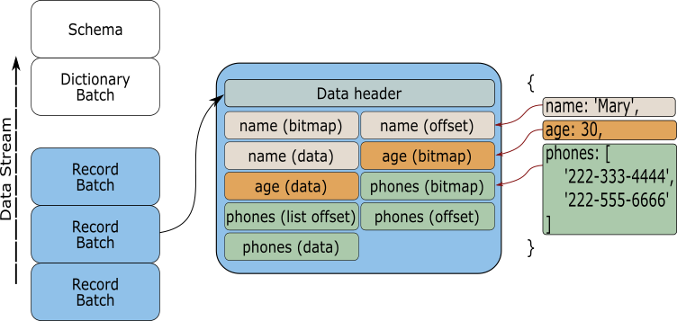

# The RecordBatch

A
[RecordBatch](https://docs.rs/arrow/3.0.0/arrow/record_batch/struct.RecordBatch.html)
is the last piece of the Arrow crate implementation. It could be said that is
the main goal of the whole Arrow specification; a structure that holds together
data and the metadata that describes it.

Have a look again at the image we saw in the introduction chapter.



Let us imagine that we are developing a service that, after executing a query,
returns formatted data with the requested information. For this service to be
efficient transferring data, the RecordBatch is an integral piece of the
process. Since each parcel of data contains all the information required to be
read and processed, any process receiving the data that **"speaks"** Arrow can
take the collected data and work on it immediately. There is no cost encoding or
decoding each parcel, it can be worked on it as soon as it is received.

We are going to cover how to transfer data in more detail in the **IPC
chapter**, but for the moment just keep in mind that a RecordBatch is one of the
keys for efficient data transfer.

## Building a RecordBatch

We will begin our exploration into the RecordBatch with an small example. In
this example we are going to create a record that will contain two columns; an
index column and a fruits column. 

```rust
use std::sync::Arc;

use arrow::{
    array::{Int32Array, StringArray},
    datatypes::{DataType, Field, Schema},
    record_batch::RecordBatch,
};

fn main() {
    let schema = Schema::new(vec![
        Field::new("index", DataType::Int32, false),
        Field::new("fruits", DataType::Utf8, false),
    ]);

    let a = Int32Array::from(vec![1, 2, 3, 4, 5]);
    let b = StringArray::from(vec!["apple", "banana", "pineapple", "melon", "pear"]);

    let record_batch =
        RecordBatch::try_new(Arc::new(schema), vec![Arc::new(a), Arc::new(b)]).unwrap();

    println!("{:#?}", record_batch);
}
```

If you run the example you should get something like this:

```json
RecordBatch {
    schema: Schema {
        fields: [
            Field {
                name: "index",
                data_type: Int32,
                nullable: false,
                dict_id: 0,
                dict_is_ordered: false,
                metadata: None,
            },
            Field {
                name: "fruits",
                data_type: Utf8,
                nullable: false,
                dict_id: 0,
                dict_is_ordered: false,
                metadata: None,
            },
        ],
        metadata: {},
    },
    columns: [
        PrimitiveArray<Int32>
        [
          1,
          2,
          3,
          4,
          5,
        ],
        StringArray
        [
          "apple",
          "banana",
          "pineapple",
          "melon",
          "pear",
        ],
    ],
}
```

### The Schema

Now, let us inspect the pieces we used to create the RecordBatch. The first new
element that we will encounter is going to be the
[Schema](https://docs.rs/arrow/3.0.0/arrow/datatypes/struct.Schema.html) struct.

```rust,ignore
    let schema = Schema::new(vec![
        Field::new("index", DataType::Int32, false),
        Field::new("fruits", DataType::Utf8, false),
    ]);
```

The Schema is used to describe the metadata that our little RecordBatch is going
to hold, and it is going to be our first source of information for the stored
data. Inside the Schema, each column has different properties that make them
unique, e.g. name, data type, etc. In order to encapsulate this information we
need to use the
[Field](https://docs.rs/arrow/3.0.0/arrow/datatypes/struct.Field.html) struct.

Each Field in the Schema is responsible for holding the name of the column, the
data type, if the column is nullable, and additional metadata. The Field
metadata can be anything extra that we may want to store and that will be useful
when reading the data from the column.

The Schema struct also has the option to store extra metadata. For example, we
can store the number of rows a column has for future reference, or the name of
the file where the data comes from. Have a look to the next example:

```rust
use std::collections::HashMap;
use arrow::datatypes::{DataType, Field, Schema};

fn main() {
    // Creating a schema with metadata
    let field_a = Field::new("a", DataType::Int64, false);
    let field_b = Field::new("b", DataType::Boolean, false);

    let mut metadata: HashMap<String, String> = HashMap::new();
    metadata.insert("row_count".to_string(), "100".to_string());
    metadata.insert("file".to_string(), "example.csv".to_string());

    let schema = Schema::new_with_metadata(vec![field_a, field_b], metadata);

    println!("{:#?}", schema);
}
```

### The RecordBatch data

The next piece of the RecordBatch is the data itself. This data comes from Arrow
arrays created using the methods we saw in previous sections.

```rust,ignore
    let a = Int32Array::from(vec![1, 2, 3, 4, 5]);
    let b = StringArray::from(vec!["apple", "banana", "pineapple", "melon", "pear"]);

    let record_batch =
        RecordBatch::try_new(Arc::new(schema), vec![Arc::new(a), Arc::new(b)]).unwrap();
```

From this snippet we can see that two columns are created using the From trait
implemented for Int32Array and StringArray.

The RecordBatch is finally constructed by passing the defined schema and a
vector of the created data. However, it should be noticed that we are using an
atomic reference (Arc) to the data and not the data itself, making the the
RecordBatch thread safe and the data zero copy. 

## Constructing from an StructArray

Probably those that have just read the previous chapter would have noticed that
a RecordBatch is very similar to an StructArray, and you are right. A
StructArray is a collection of Arrow arrays identified using Field structs. Both
share a similar data structure, and because of this similarity we can construct
a RecordBatch from them.

Have a look at the next code:

```rust
use std::sync::Arc;

use arrow::{
    array::{ArrayRef, BooleanArray, Int32Array, StructArray},
    datatypes::{DataType, Field, Schema},
    record_batch::RecordBatch,
};

fn main() {
    let index = Arc::new(Int32Array::from(vec![0, 1, 2, 3]));
    let boolean_array = Arc::new(BooleanArray::from(vec![false, false, true, true]));
    let int_array = Arc::new(Int32Array::from(vec![42, 28, 19, 31]));

    let struct_array = StructArray::from(vec![
        (
            Field::new("index", DataType::Int32, false),
            index as ArrayRef,
        ),
        (
            Field::new("col_1", DataType::Int32, false),
            int_array as ArrayRef,
        ),
        (
            Field::new("col_2", DataType::Boolean, false),
            boolean_array as ArrayRef,
        ),
    ]);

    let record_batch = RecordBatch::from(&struct_array);
    println!("{:#?}", record_batch);
}
```

The output should look like this:

```json
RecordBatch {
    schema: Schema {
        fields: [
            Field {
                name: "index",
                data_type: Int32,
                nullable: false,
                dict_id: 0,
                dict_is_ordered: false,
                metadata: None,
            },
            Field {
                name: "col_1",
                data_type: Int32,
                nullable: false,
                dict_id: 0,
                dict_is_ordered: false,
                metadata: None,
            },
            Field {
                name: "col_2",
                data_type: Boolean,
                nullable: false,
                dict_id: 0,
                dict_is_ordered: false,
                metadata: None,
            },
        ],
        metadata: {},
    },
    columns: [
        PrimitiveArray<Int32>
        [
          0,
          1,
          2,
          3,
        ],
        PrimitiveArray<Int32>
        [
          42,
          28,
          19,
          31,
        ],
        BooleanArray
        [
          false,
          false,
          true,
          true,
        ],
    ],
}
```

As you can see we can construct a RecordBatch easily from the Struct array. This
is because the **From** trait is implemented for the RecordBatch. 

## Nested structures

To finish this section, we are going to see how to create a nested structure
using the tools that can be found within the RecorBatch struct. As you will see
the procedure is fairly straight forward, all we have to do is to define the
StructArray with all its columns and then add it to the schema as it is another
column of the RecordBatch.

The next snippet of code shows an example of how a nested structure could look
by introducing a Struct Array as one of the columns in the RecordBatch. The
resulting RecordBatch will have two columns; one called id and a another called
nested.

```rust
use std::sync::Arc;

use arrow::{
    array::{Array, Float64Array, Int32Array, StringArray, StructArray},
    datatypes::{DataType, Field, Schema},
    record_batch::RecordBatch,
};

fn main() {
    let schema = Schema::new(vec![
        Field::new("id", DataType::Int32, false),
        Field::new(
            "nested",
            DataType::Struct(vec![
                Field::new("a", DataType::Utf8, false),
                Field::new("b", DataType::Float64, false),
                Field::new("c", DataType::Float64, false),
            ]),
            false,
        ),
    ]);

    let id = Int32Array::from(vec![1, 2, 3, 4, 5]);

    let nested = StructArray::from(vec![
        (
            Field::new("a", DataType::Utf8, false),
            Arc::new(StringArray::from(vec!["a", "b", "c", "d", "e"])) as Arc<dyn Array>,
        ),
        (
            Field::new("b", DataType::Float64, false),
            Arc::new(Float64Array::from(vec![1.1, 2.2, 3.3, 4.4, 5.5])),
        ),
        (
            Field::new("c", DataType::Float64, false),
            Arc::new(Float64Array::from(vec![2.2, 3.3, 4.4, 5.5, 6.6])),
        ),
    ]);

    let record_batch =
        RecordBatch::try_new(Arc::new(schema), vec![Arc::new(id), Arc::new(nested)]).unwrap();

    println!("{:#?}", record_batch);
}

```

After running the previous code you should see something like this:

```rust
RecordBatch {
    schema: Schema {
        fields: [
            Field {
                name: "id",
                data_type: Int32,
                nullable: false,
                dict_id: 0,
                dict_is_ordered: false,
                metadata: None,
            },
            Field {
                name: "nested",
                data_type: Struct(
                    [
                        Field {
                            name: "a",
                            data_type: Utf8,
                            nullable: false,
                            dict_id: 0,
                            dict_is_ordered: false,
                            metadata: None,
                        },
                        Field {
                            name: "b",
                            data_type: Float64,
                            nullable: false,
                            dict_id: 0,
                            dict_is_ordered: false,
                            metadata: None,
                        },
                        Field {
                            name: "c",
                            data_type: Float64,
                            nullable: false,
                            dict_id: 0,
                            dict_is_ordered: false,
                            metadata: None,
                        },
                    ],
                ),
                nullable: false,
                dict_id: 0,
                dict_is_ordered: false,
                metadata: None,
            },
        ],
        metadata: {},
    },
    columns: [
        PrimitiveArray<Int32>
        [
          1,
          2,
          3,
          4,
          5,
        ],
        StructArray
        [
        -- child 0: "a" (Utf8)
        StringArray
        [
          "a",
          "b",
          "c",
          "d",
          "e",
        ]
        -- child 1: "b" (Float64)
        PrimitiveArray<Float64>
        [
          1.1,
          2.2,
          3.3,
          4.4,
          5.5,
        ]
        -- child 2: "c" (Float64)
        PrimitiveArray<Float64>
        [
          2.2,
          3.3,
          4.4,
          5.5,
          6.6,
        ]
        ],
    ],
}
```

As you can see, a RecordBatch is a very powerful structure that will let us put
together the information we want to process or share. We are going to keep using
it for different examples along this book.