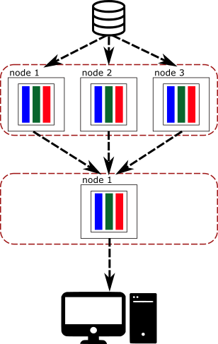

# Arrow IPC (Interprocess communication)

In the previous section we have seen how to create Arrow arrays and batches
using the Rust API. This data could have been created from a running process
executing a query, and now it can be used for data analytics by any process
that requested it. Or probably, the generated piece of data is just part of a
bigger calculation that needs to be sent to other nodes to complete the
distributed operation. 

  

As you can see, the consumer of the data may not be in the same node and doesn't
have access to the memory and the Arrow data. For this, and many other reasons,
the producer needs a way to be able to send and share data with other processes.

Here is where the IPC specification starts to shine. In Arrow, the IPC is a
standard specification that all implementations of Arrow follow so they can
share data easily, and since all of them follow the same specification, there
is no need to serialize and deserialize from one representation to another.

In this section we are going to see how data can be sent between processes using
the available IPC API, either by storing the data in disk or by sending it
through the wire. We are going to start by describing the protocols that Arrow
uses to send information about the data and after that we are going to see some
examples to move and share Arrow data.